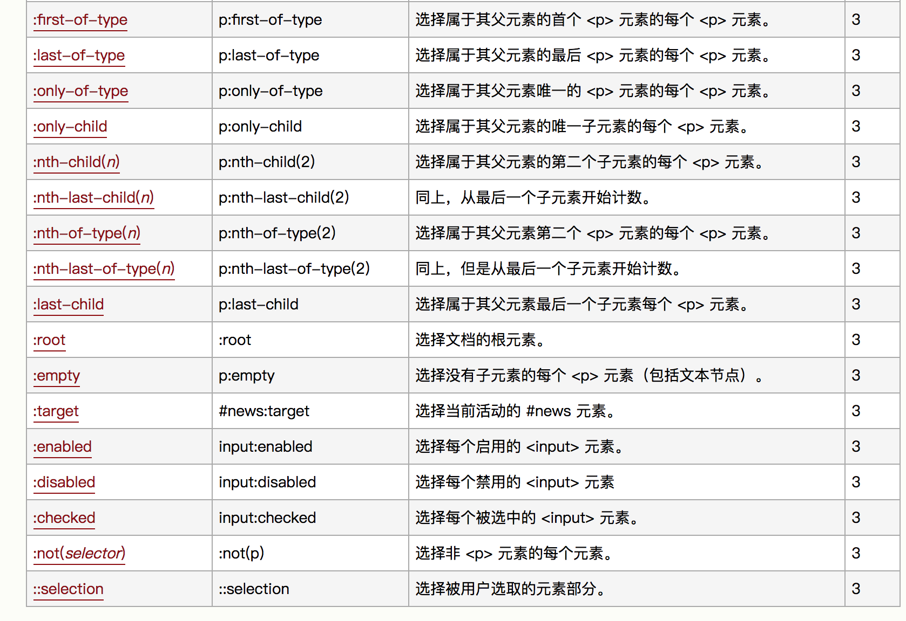

今天团队中一个正在交接的小弟出去面试，气冲冲的回来吐槽面试官不会面试，竟然会问CSS选择器，在我苦口婆心的劝说下，小弟终于意识到CSS选择器的重要性，为了让他能够找到一个好工作，我便写了这篇文章供他学习。

## 简介

### 定义

我们都知道一条CSS样式定义有两部分组成，形式如下：`选择器 {}`，在`{}`之前的部分就是选择器。选择器指明了`{}`中的样式的作用对象，也就是样式作用于网页中的哪些元素。

### 作用

CSS选择器用于定位我们想要给予样式的 HTML 元素，但不只是在 CSS 中，JavaScript 对 CSS 的选择器也是支持的，比如`document.querySelector`、`document.querySelectorAll`。

## 分类

### 基本选择器

| 选择器      | 名称        | 描述                          | 版本 |
| ------     | ------     | ------                        | ------ |
| *          | 通配选择器   | 选择所有的元素                  | CSS2 |
| element    | 元素选择器   | 选择指定的元素                  | CSS1 |
| #idName    | id选择器    | 选择id属性等于idName的元素        | CSS1 |
| .className | 类选择器     | 选择class属性包含className的元素 | CSS1 |

#### 通配符选择器「 * 」
这个选择器是匹配页面中所有的元素，选择器也能选取另一个元素中的所有元素，不过这个选择器的效率比较低，一般用来清除浏览器的默认样式。
``` css
/* 清楚浏览器默认样式 */
* {
    margin: 0; 
    padding: 0;
}

div * { 
    color: red;
}
```
``` html
<div>
    <span>span</span>
    <p>p</p>
</div>
```
span，p 都变红。

#### 元素选择器「 element 」
通过标签名来选择元素。
``` css
div {
    color: red;
}
```
``` html
<div>div1</div>
<p>
    <div>div2</div>
</p>
<div>div3</div>
```
div1，div2，div3 都变红
#### id选择器「 #idName 」
以id属性来命名，在页面中只能出现一次，具有唯一性，并且权重值最高，相当于一个人的身份证。注意：应用于多个元素，样式同样生效。
``` html
<div id="box">div</div>
<p id="box">p</p>
```
``` css
#box {
    color: red;
}
```
div，p都变红。

#### 类选择器 「 .className 」
class选择器/类选择器/用class属性给元素命名，在页面中可以出现很多次，相当于人的名字。
``` html
<div class="box">div</div>
<p class="box">p</p>
```
``` css
.box {
    color: red;
}
```
div，p 都变红。

### 组合选择器

| 选择器      | 名称        | 描述                          | 版本 |
| ------     | ------     | ------                        | ------ |
| E,F         | 多元素选择器   | 同时匹配元素E或元素F | CSS1 |
| E F    | 后代选择器   | 匹配E元素所有的后代（不只是子元素、子元素向下递归）元素F | CSS1 |
| E > F    | 子元素选择器    | 匹配E元素的所有直接子元素F       | CSS2 |
| E + F | 相邻兄弟选择器    | 匹配E元素之后的相邻的同级元素F | CSS2 |
| E ~ F | 普通兄弟选择器    | 匹配E元素之后的同级元素F（无论直接相邻与否） | CSS3 |

#### 多元素选择器 「 E,F 」
选择所有的E元素和F元素，中间用逗号隔开。
``` html
<div>div</div>
<p>p</p>
```
``` css
// 同时匹配div标签和p标签
div, p {
    color: red;
}
```
div，p 都变红。
#### 后代选择器 「 E F 」
选择所有被E元素包含的所有的F元素（包括子、孙），中间用空格隔开。
``` html
<div>
    <span>span1</span>
    <p>
        <span>span2</span>
    </p>
    <span>span3</span>
</div>
```
``` css
div span {
    color: red;
}
```
span1，span2，span3 都变红。

#### 子元素选择器 「 E > F 」
选择所有作为E元素的直接子元素F，对更深一层的元素不起作用，用 > 表示。
``` html
<div>
    <span>span1</span>
    <p>
        <span>span2</span>
    </p>
    <span>span3</span>
</div>
```
``` css
div > span {
    color: red;
}
```
span1，span3 变红。

#### 相邻兄弟选择器 「 E + F 」
选择紧跟E元素后的F元素，用 + 表示，选择相邻的第一个兄弟元素。
``` html
<p>p1</p>
<div>div
    <p>p2</p>
</div>
<p>p3</p>
<span>span</span>
<p>p4</p>
```
``` css
div + p { 
    color: red;
}
```
p3 变红。

#### 普通兄弟选择器 「 E ~ F 」
选择E元素之后的所有同级元素F（无论直接相邻与否），作用于多个元素，用 ~ 隔开。
``` html
<p>p1</p>
<div>div
    <p>p2</p>
</div>
<p>p3</p>
<span>span</span>
<p>p4</p>
```
``` css 
div ~ p { 
    color: red;
}
```
p3，p4 变红。

### 属性选择器
| 选择器      | 例子        | 例子描述                          | 版本 |
| ------     | ------     | ------                        | ------ |
| [attribute]         | [target]   | 选择所有带有target属性元素。 | CSS2 |
| [attribute=value]   | [target=_blank]   | 选择 target="_blank" 的所有元素。 | CSS2 |
| [attribute~=value]    | [title~=flower]    | 选择 title 属性包含单词 "flower" 的所有元素。       | CSS2 |
| [attribute&#124;=value]    | [lang&#124;=en]    | 选择 lang 属性值以 "en" 开头的所有元素。      | CSS2 |
| [attribute^=value]] | a[src^="https"]    | 选择其 src 属性值以 "https" 开头的每个 a 元素。 | CSS3 |
| [attribute$=value] | a[src$=".pdf"]    | 选择其 src 属性以 ".pdf" 结尾的所有 a 元素。 | CSS3 |
| [attribute*=value] | a[src*="abc"]    | 选择其 src 属性中包含 "abc" 子串的每个 a 元素。 | CSS3 |

### 伪类选择器

| 选择器      | 例子        | 例子描述                          | 版本 |
| ------     | ------     | ------                        | ------ |
| :link         | a:link   | 选择所有未被访问的链接。 | CSS1 |
| :visited   | a:visited   | 选择所有已被访问的链接。 | CSS1 |
| :active    | a:active    | 选择活动链接。       | CSS1 |
| :hover    | a:hover    | 选择鼠标指针位于其上的链接。       | CSS1 |
| :focus | input:focus    | 选择获得焦点的 input 元素。 | CSS2 |

### 伪元素选择器

| 选择器      | 例子        | 例子描述                          | 版本 |
| ------     | ------     | ------                        | ------ |
| :first-letter | p:first-letter    | 选择每个 p 元素的首字母。 | CSS1 |
| :first-line | p:first-line    | 选择每个 p 元素的首行。 | CSS1 |
| :first-child | p:first-child   | 选择属于父元素的第一个子元素的每个 p 元素。 | CSS2 |
| :before | p:before    | 在每个 p 元素的内容之前插入内容。 | CSS2 |
| :after | p:after    | 在每个 p 元素的内容之后插入内容。 | CSS2 |
| :lang(language) | p:lang(it)   | 选择带有以 "it" 开头的 lang 属性值的每个 p 元素。 | CSS2 |

### 补充内容

更多伪类、伪元素选择器，见如下截图：



## 优先级

当创建的样式表越来越复杂时，一个标签的样式将会受到越来越多的影响，用户看到的其实是通过**层叠计算**得来的，通俗点讲就是先计算再重叠得来的。
>**计算**指的是用户代理（浏览器只是用户代理的一种“实例”）在渲染HTML的时候，对CSS进行层叠计算的过程。

> **层叠**是CSS的一个基本特征，它是一个定义了如何合并来自多个源的属性值的算法。它在CSS处于核心地位，CSS的全称层叠样式表正是强调了这一点。

说到这，我们就不得不说一下优先级。优先级是决定不同选择器的相同样式规则对同一元素的生效情况，优先级高的将覆盖优先级低的样式规则。而优先级又受到样式来源和选择器特殊性的影响。

### 特指度

说到优先级，我们又需要讲一下另一个概念：**特指度**。特指度表示一个css选择器表达式的重要程度，可以通过一个公式来计算出一个数值，数越大，越重要。这个计算叫做“I-C-E”计算公式；
**1.**I——Id：100 
**2.**C——Class（类 | 伪类 | 属性选择）：10 
**3.**E——Element（标签 | 伪元素）：1
**4.** 通用选择器：0

即针对一个css选择器表达式，遇到一个id就往特指度数值中加100，遇到一个class就往特指度数值中加10，遇到一个element就往特指度数值中加1。

下面举几个css表达式的特指度计算结果：

| CSS选择器表达式     | 特指度计算结果  |
| ------     | ------     |
| p | 1    | 
| p.large | 11    | 
| p#large | 101   |
| div p#large | 102    |
| div p#large ul.list | 113   |
| div p#large ul.list li | 114   |

还有一个特别重要的点：**!important优先级最高，高于上面一切。通配（*） 选择器最低，低于一切**。

#### 错误的说法

在学习过程中，我们可能发现给选择器加权值的说法，即 ID 选择器权值为 100，类选择器权值为 10，标签选择器权值为 1，当一个选择器由多个 ID 选择器、类选择器或标签选择器组成时，则将所有权值相加，然后再比较权值。这种说法其实是有问题的。比如一个由 11 个类选择器组成的选择器和一个由 1 个 ID 选择器组成的选择器指向同一个标签，按理说 110 > 100，应该应用前者的样式，然而事实是应用后者的样式。**错误的原因是：选择器的权值不能进位。**虽然 11 个类选择器组成的选择器的总权值为 110，但因为 11 个均为类选择器，所以其实总权值最多不能超过 100， 我们可以理解为 99.99，所以最终应用后者样式。

### 多重样式间的优先级

w3school给出的优先级顺序从低到高是：
> 浏览器缺省设置
外部样式表
内部样式表（位于 head 标签内部）
内联样式（在 HTML 元素内部）

但如果外部样式表放在内部样式表后面其实是会覆盖内部样式表的，举个例子：

``` html
<!DOCTYPE html>
<html lang="en">
<head>
    <meta charset="UTF-8">
    <meta name="viewport" content="width=device-width, initial-scale=1.0">
    <meta http-equiv="X-UA-Compatible" content="ie=edge">
    <title>Document</title>
    <style>
        .box { 
            color: red;
        }
    </style>
    <link rel="stylesheet" type="text/css" href="index.css" />
</head>
<body>
    <div class="box">div</div>
</body>
</html>
```
```css
.box {
    color: blue;
}
```
最终得到的是蓝色的字体，很明显，内部样式被放在后面的外部样式覆盖了。所以我更倾向于认为外部样式表和内部样式表具有相同的优先级。

除了选择器，样式自身还可以继承和提升优先级，规则如下：
**一：**从祖先元素继承来的样式优先级低于通用选择器；甚至低于浏览器的缺省设置，比如最常见的，重置链接的默认样式时必须写在链接元素上，放在祖先元素中是没有卵用滴
**二：**使用大杀器!important可将样式提升到最高等级，不管这个样式在哪个样式表或选择器中；如果在同一样式中出现了多个!important，就得看上面的权重规则进行pk了。

因此多重样式间遵循：**继承来的样式 < 浏览器缺省设置 < 外部样式表 = 内部样式表 < 内联样式**

### 总结
优先级正确的排序是：

``` js
important > 内联样式 > ID > 类 | 伪类 | 属性选择 > 标签 | 伪元素 > 继承 > 通配符
```


