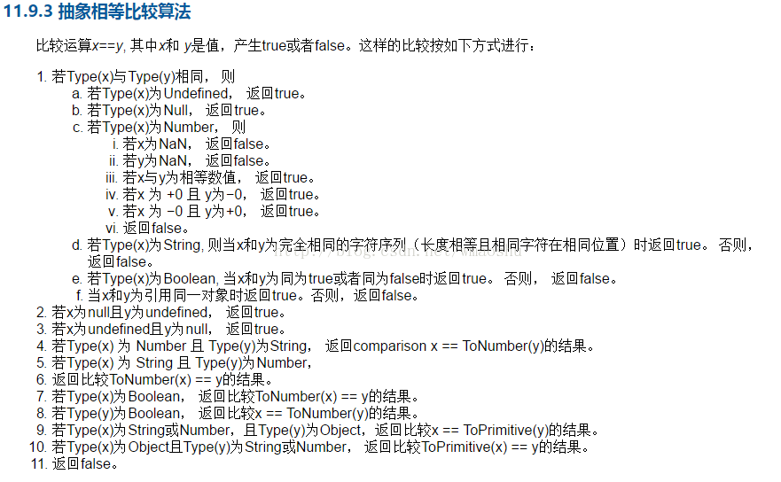
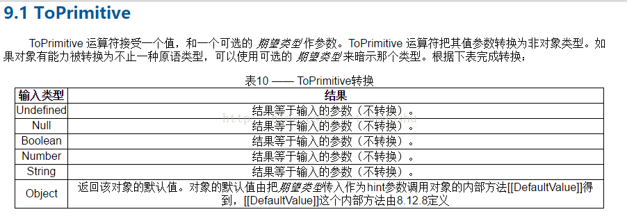
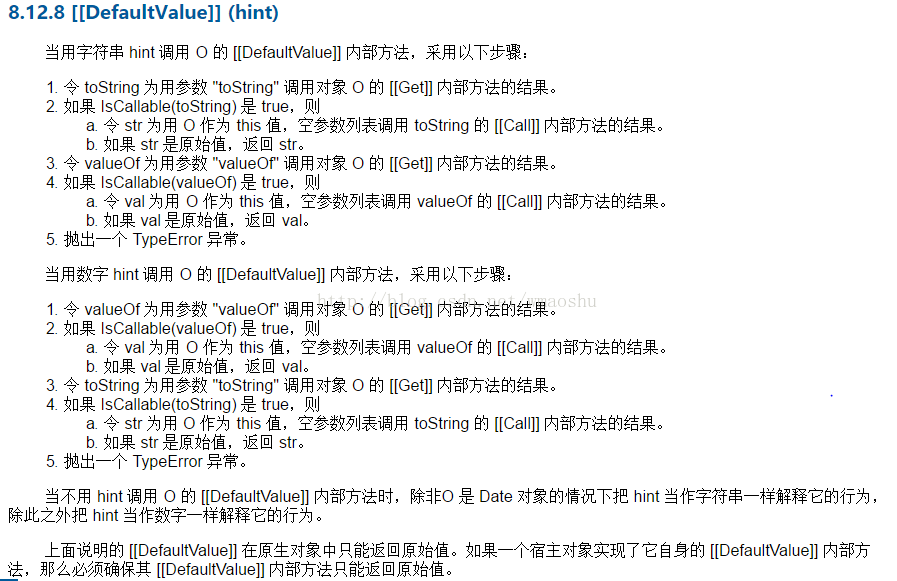

## 概述

JavaScript中，相等运算符（==）是一个很让人头痛的运算符，它的语法行为多变，不符合直觉。比如下面这个表达式，它的值是什么？想知道答案或语言内部怎么处理，我们可以去查看规格。规格对每一种语法行为的描述，都分成两部分：先是总体的行为描述，然后是实现的算法细节。相等运算符的总体的行为描述：相等运算符用于比较两个值，返回true或false。

## 抽象比较算法



在执行抽象相等比较算法的过程中，会发现会将xy操作数进行隐式类型转化的，这也是==运算符副作用的体现。

### ToPrimitive()



toPrimitive方法的目的就是将输入的参数转化成非对象类型。

### DefaultValue()


由于0的类型是数值，null的类型是 Null（这是规格4.3.13 小节的规定，是内部 Type 运算的结果，跟typeof运算符无关）。因此上面的前 11 步都得不到结果，要到第 12 步才能得到false。
``` js
0 == null // 输出结果：false  解析：0 数值 null 对象  返回 false
```

## [] == false
**正确输出结果：**true

当js引擎解析到[] == false 的时候，会解析执行左右表达式，并分别取出执行结果的值，上述分别为数组对象和false。然后将数组设置为x，false设置为y按抽象比较算法执行。在执行抽象相等比较算法的过程中，会发现会将xy操作数进行隐式类型转化的，这也是==运算符副作用的体现。

对于 [] == false的问题应该关注上述步骤的78910步骤。因为[]和false不是同一类型，所以执行到8的时候会将false调用toNumber()内部方法转化成数字，然后在执行抽象相等比较算法。toNumber（）会将false转化成+0.

然后将[] == +0.继续进行比较算法，执行到10 之后开始使用toPrimitive( )对[]进行转化。

## [] == []

**正确输出结果：**false

## 0 == null

**正确输出结果：**false

## [] == {}
**正确输出结果：**false

## 其他例子
``` js
null == undefined; // 如果x是null，y是undefined，返回true。
1 == true // 如果Type(x)是布尔值，返回ToNumber(x) == y的结果，true转化为数值1，所以输出结果：true  
2 == true // 如果Type(x)是布尔值，返回ToNumber(x) == y的结果，true转化为数值1，所以输出结果：false
0 == false // 如果Type(x)是布尔值，返回ToNumber(x) == y的结果，true转化为数值0，所以输出结果：true
0 == "" // 如果Type(x)是字符串，Type(y)是数值，返回ToNumber(x) == y的结果，""转化为数值0，所以输出结果：true

undefined == ""; // false
null == false; // false
undefined == false; // false

```


