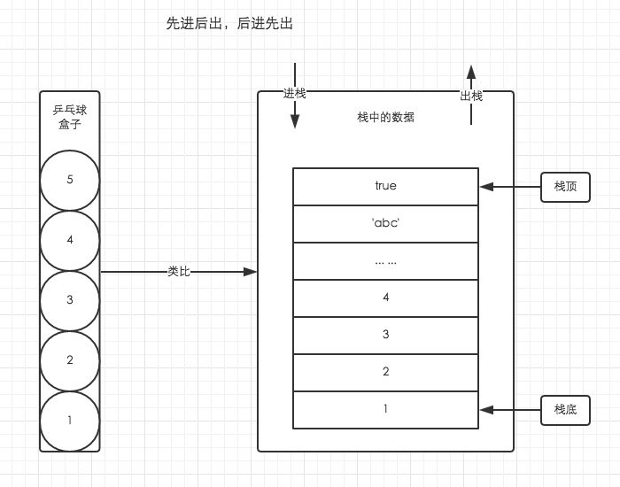
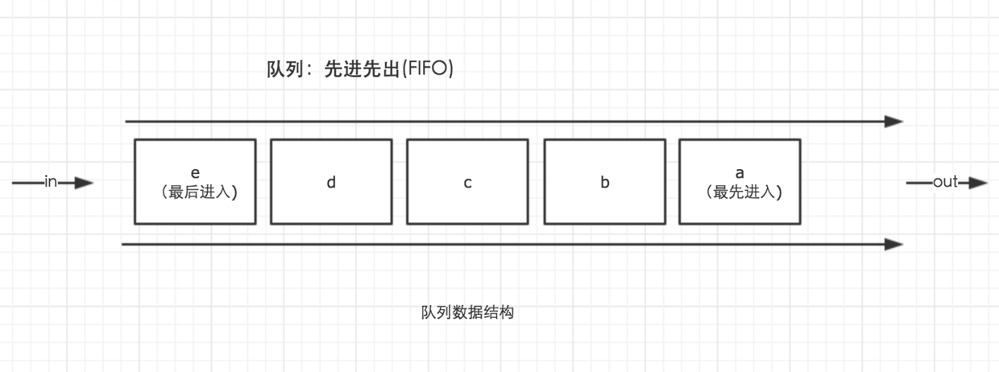
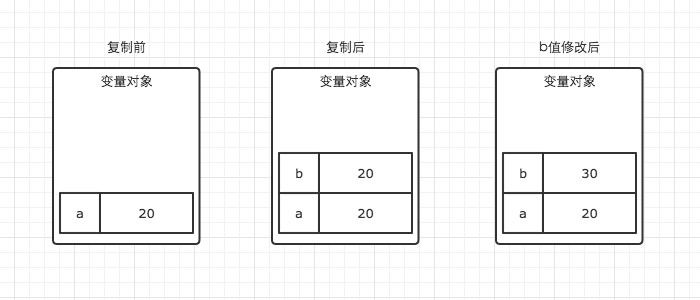
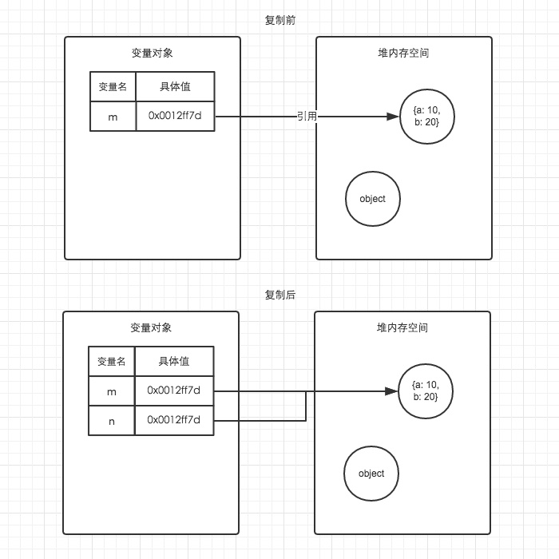

## 概述

JavaScript 语言的每一个值，都属于某一种数据类型。JavaScript 的数据类型，共有六种。（ES6 又新增了第七种 Symbol 类型的值）。
> **数值（number）：**整数和小数（比如1和3.14）；
**字符串（string）：**文本（比如Hello World）；
**布尔值（boolean）：**表示真伪的两个特殊值，即true（真）和false（假）；
**undefined：**表示“未定义”或不存在，即由于目前没有定义，所以此处暂时没有任何值；
**null：**表示空值，即此处的值为空；
**对象（object）：**各种值组成的集合。

通常，数值、字符串、布尔值这三种类型，合称为原始数据类型（primitive type）的值，即它们是最基本的数据类型，不能再细分了。对象则称为合成数据类型（complex type）的值，即引用数据类型，因为一个对象往往是多个原始类型的值的合成，可以看作是一个存放各种值的容器。至于undefined和null，一般将它们看成两个特殊值。

### 基本数据类型

JavaScript中有5种基础数据类型，分别是Number、String、Boolean、Undefined、Null。

#### 基本数据类型存放在栈中

基础数据类型是存放在栈内存中的简单数据段，数据大小确定，内存空间大小可以自由分配。是直接按值存放的，所以我们可以直接操作保存在变量中的实际的值。

#### 基本数据类型值不可变(immutable)性质
基本类型是不可变的(immutable)，只有对象是可变的(mutable)。有时我们会尝试“改变”字符串的内容，但在JS中，任何看似对string值的”修改”操作，实际都是创建新的string值。任何方法都无法改变一个基本类型的值：
``` js
var str = "abc";
str[0] = "d";
str.name = "efg";
str.method = function() {

};
console.log(str); // abc
console.log(str[0]); // a
console.log(str.name); // undefined
console.log(str.method); // undefined
```

#### 基本类型的比较是值的比较

基本类型的比较是值的比较，只要它们的值相等就认为他们是相等的，例如：
``` js
var a = 1;
var b = 1;
console.log(a === b); // true
```
比较的时候最好使用严格等，因为 == 是会进行类型转换的，比如
``` js
var a = 1;
var b = true;
console.log(a == b); // true
```

### 引用数据类型

#### 引用数据类型存放在堆中

引用类型（object）是存放在堆内存中的，变量实际上是一个存放在栈内存的指针，这个指针指向堆内存中的地址。每个空间大小不一样，要根据情况开进行特定的分配。

#### 引用类型值可变
引用类型的值是可变的。
``` js
var obj = {
    x: 0
};
obj.x = 100;
console.log(obj.x)// 100 被修改
obj = { // 等同于重新赋值，重新开辟内存，不是修改
    x: 1000
};  
console.log(obj.x)// 1000 被修改
```

#### 引用类型的比较是引用的比较

每次我们对 js 中的引用类型进行操作的时候，都是操作其对象的引用（保存在栈内存中的指针），所以比较两个引用类型，是看其的引用是否指向同一个对象。例如：

``` js
var a = [1,2,3];
var b = [1,2,3];
console.log(a === b); // false
```

### 传值与传址
>JavaScript 所有函数的参数都是按值传递的,也就是说把函数外部的值复制给函数内部的参数，就和把值从一个变量复制到另一个变量一样。

基本数据类型：在我们进行赋值或方法调用操作的时候，基本数据类型的赋值（=）是在内存中新开辟一段栈内存，然后再把再将值赋值到新的栈中，前后两个变量是两个独立相互不影响的变量，比如：
``` js
var a = 10;
var b = a;

a ++ ;
console.log(a); // 11
console.log(b); // 10
```

引用数据类型：在引用类型的赋值或方法调用时，传递的是值的内存地址，也就是说传递前和传递后都指向栈中同一个引用（也就是同一个内存空间），这样的话两个变量就指向同一个对象，因此两者之间操作互相有影响，比如
``` js
var person = {
    name : "Tom"
};
function obj(peo) {
    peo.name = "Jerry";
    peo = { // 等同于重新赋值，重新开辟内存，不是修改
        name : "Jack"
    };
}
obj(person);
console.log(person.name); // Jerry
```

## 数据结构

### 栈数据结构

与C/C++不同，JavaScript中并没有严格意义上区分栈内存与堆内存。因此我们可以简单粗暴的理解为JavaScript的所有数据都保存在堆内存中。但是在某些场景，我们仍然需要基于堆栈数据结构的思维来实现一些功能，比如JavaScript的执行上下文。执行上下文的执行顺序借用了栈数据结构的存取方式，因此理解栈数据结构的原理与特点十分重要。

要简单理解栈的存取方式，我们可以通过类比乒乓球盒子来分析，如下图左侧：



这种乒乓球的存放方式与栈中存取数据的方式如出一辙。处于盒子中最顶层的乒乓球5，它一定是最后被放进去，但可以最先被使用。而我们想要使用底层的乒乓球1，就必须将上面的4个乒乓球取出来，让乒乓球1处于盒子顶层。这就是栈空间先进后出，后进先出的特点。图中已经详细的表明了栈空间的存储原理。

### 堆数据结构

堆数据结构是一种树状结构。它的存取数据的方式，则与书架与书非常相似。

书虽然也整齐的存放在书架上，但是我们只要知道书的名字，我们就可以很方便的取出我们想要的书，而不用像从乒乓球盒子里取乒乓一样，非得将上面的所有乒乓球拿出来才能取到中间的某一个乒乓球。好比在JSON格式的数据中，我们存储的key-value是可以无序的，因为顺序的不同并不影响我们的使用，我们只需要关心书的名字。

### 队列

在JavaScript中，理解队列数据结构的目的主要是为了清晰的明白事件循环（Event Loop）的机制到底是怎么回事。

队列是一种先进先出（FIFO）的数据结构。正如排队过安检一样，排在队伍前面的人一定是最先过检的人，用以下的图示可以清楚的理解队列的原理：



### 引用数据类型与堆内存

与其他语言不同，JS的引用数据类型，比如数组Array，它们值的大小是不固定的。引用数据类型的值是保存在堆内存中的对象。JavaScript不允许直接访问堆内存中的位置，因此我们不能直接操作对象的堆内存空间。在操作对象时，实际上是在操作对象的引用而不是实际的对象。因此，引用类型的值都是按引用访问的。这里的引用，我们可以理解为保存在变量对象中的一个地址，该地址与堆内存的实际值相关联。

为了更好的搞懂变量对象与堆内存，我们可以结合以下例子与图解进行理解。

``` js
var a1 = 0;   // 原始变量
var a2 = 'this is string'; // 原始变量
var a3 = null; // 原始变量

var b = { m: 20 }; // 变量b存在于变量对象中，{m: 20} 作为对象存在于堆内存中
var c = [1, 2, 3]; // 变量c存在于变量对象中，[1, 2, 3] 作为对象存在于堆内存中
```


因此当我们要访问堆内存中的引用数据类型时，实际上我们首先是从变量对象中获取了该对象的地址引用（或者地址指针），然后再从堆内存中取得我们需要的数据。

在前端面试中我们常常会遇到这样一个类似的题目：
``` js
// demo01.js
var a = 20;
var b = a;
b = 30;

// 这时a的值是多少？
```
``` js
// demo02.js
var m = { a: 10, b: 20 }
var n = m;
n.a = 15;

// 这时m.a的值是多少
```
在变量对象中的数据发生复制行为时，系统会自动为新的变量分配一个新值。var b = a执行之后，a与b虽然值都等于20，但是他们其实已经是相互独立互不影响的值了。具体如图。所以我们修改了b的值以后，a的值并不会发生变化。

在demo02中，我们通过var n = m执行一次复制引用类型的操作。引用类型的复制同样也会为新的变量自动分配一个新的值保存在变量对象中，但不同的是，这个新的值，仅仅只是引用类型的一个地址指针。当地址指针相同时，尽管他们相互独立，但是在变量对象中访问到的具体对象实际上是同一个。如图所示。

因此当我改变n时，m也发生了变化。这就是引用类型的特性。


## 拷贝

首先深拷贝和浅拷贝只针对像 Object, Array 这样的复杂对象的。简单来说，浅拷贝只拷贝一层对象的属性，而深拷贝则递归拷贝了所有层级。

### 浅拷贝

下面是一个简单的浅拷贝实现：

``` js
var obj = { a:1, arr: [2,3] };
var shallowObj = shallowCopy(obj);

function shallowCopy(src) {
  var dst = {};
  for (var prop in src) {
    if (src.hasOwnProperty(prop)) {
      dst[prop] = src[prop];
    }
  }
  return dst;
}
```

因为浅拷贝只会将对象的各个属性进行依次拷贝，并不会进行递归拷贝，而 JavaScript 存储对象都是存地址的，所以浅拷贝会导致 obj.arr 和 shallowObj.arr 指向同一块内存地址，大概的示意图如下：


导致的结果就是：

``` js
shallowObj.arr[1] = 5;
obj.arr[1]   // = 5
```

### 深拷贝

而深拷贝则不同，它不仅将原对象的各个属性逐个复制出去，而且将原对象各个属性所包含的对象也依次采用深拷贝的方法递归复制到新对象上。这就不会存在上面 obj 和 shallowObj 的 arr 属性指向同一个对象的问题。

``` js
var obj = { a:1, arr: [1,2] };
var obj2 = deepCopy(obj);
```
结果如下面的示意图所示：


需要注意的是，如果对象比较大，层级也比较多，深拷贝会带来性能上的问题。在遇到需要采用深拷贝的场景时，可以考虑有没有其他替代的方案。在实际的应用场景中，也是浅拷贝更为常用。