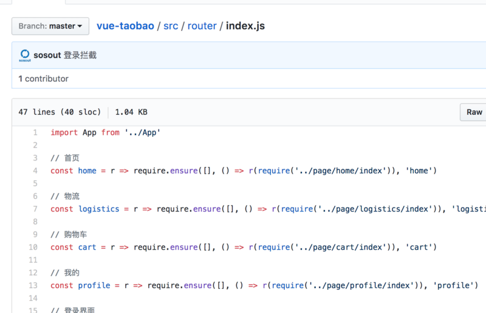
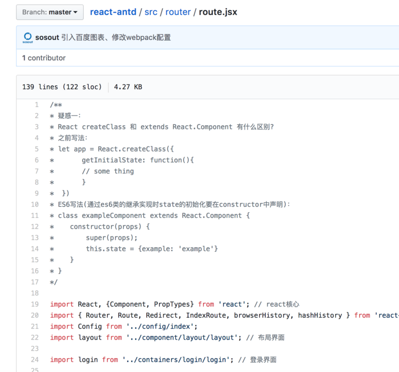

最近好多伙伴说，我用vue做的项目本地是可以的，但部署到服务器遇到好多问题：`资源找不到`，`直接访问index.html页面空白`，`刷新当前路由404`。。。用react做的项目也同样遇到类似问题。现在我们一起讨论下单页面如何部署到服务器？

由于前端路由缘故，单页面应用应该放到`nginx或者apache、tomcat等web代理服务器中，千万不要直接访问index.html，同时要根据自己服务器的项目路径更改react或vue的路由地址`。

如果说项目是直接跟在域名后面的，比如:`http://www.sosout.com`，根路由就是`/`。如果说项目是直接跟在域名后面的一个子目录中的，比如:`http://www.sosout.com/children` ，根路由就是`/children`，不能直接访问`index.html`。

**以配置`nginx`为例，配置过程大致如下：**

我们首先假设以下两条规则：
`1. 项目文件目录： /mnt/html/spa（spa目录下的文件就是执行了npm run dist 后生成的dist目录下的文件）`
`2. 访问域名：spa.sosout.com` 

进入`nginx.conf`新增如下配置：

``` nginx
server {
    listen 80;
    server_name  spa.sosout.com;
    root /mnt/html/spa;
    index index.html;
    location ~ ^/favicon\.ico$ {
        root /mnt/html/spa;
    }

    location / {
        try_files $uri $uri/ /index.html;
        proxy_set_header   Host             $host;
        proxy_set_header   X-Real-IP        $remote_addr;
        proxy_set_header   X-Forwarded-For  $proxy_add_x_forwarded_for;
        proxy_set_header   X-Forwarded-Proto  $scheme;
    }
    access_log  /mnt/logs/nginx/access.log  main;
}
```

注意事项：
`1、配置域名的话，需要80端口，成功后，只要访问域名即可访问的项目`
`2、如果你使用了react-router的 browserHistory 模式或 vue-router的 history 模式，在nginx配置还需要重写路由：`

``` nginx
server {
    listen 80;
    server_name  spa.sosout.com;
    root /mnt/html/spa;
    index index.html;
    location ~ ^/favicon\.ico$ {
        root /mnt/html/spa;
    }

    location / {
        try_files $uri $uri/ @fallback;
        index index.html;
        proxy_set_header   Host             $host;
        proxy_set_header   X-Real-IP        $remote_addr;
        proxy_set_header   X-Forwarded-For  $proxy_add_x_forwarded_for;
        proxy_set_header   X-Forwarded-Proto  $scheme;
    }
    location @fallback {
        rewrite ^.*$ /index.html break;
    }
    access_log  /mnt/logs/nginx/access.log  main;
}
```

**为什么要重写路由？**`因为我们的项目只有一个根入口，当输入类似/home的url时，如果找不到对应的页面，nginx会尝试加载index.html，这是通过react-router或vue-router就能正确的匹配我们输入的/home路由，从而显示正确的home页面，如果browserHistory模式或history模式的项目没有配置上述内容，会出现404的情况。`

简单举两个例子，一个`vue`项目一个`react`项目：

**vue项目：**

域名：`http://tb.sosout.com`


``` jsx
import App from '../App'

// 首页
const home = r => require.ensure([], () => r(require('../page/home/index')), 'home')

// 物流
const logistics = r => require.ensure([], () => r(require('../page/logistics/index')), 'logistics')

// 购物车
const cart = r => require.ensure([], () => r(require('../page/cart/index')), 'cart')

// 我的
const profile = r => require.ensure([], () => r(require('../page/profile/index')), 'profile')

// 登录界面
const login = r => require.ensure([], () => r(require('../page/user/login')), 'login')

export default [{
  path: '/',
  component: App, // 顶层路由，对应index.html
  children: [{
    path: '/home', // 首页
    component: home
  }, {
    path: '/logistics', // 物流
    component: logistics,
    meta: {
      login: true
    }
  }, {
    path: '/cart', // 购物车
    component: cart,
    meta: {
      login: true
    }
  }, {
    path: '/profile', // 我的
    component: profile
  }, {
    path: '/login', // 登录界面
    component: login
  }, {
    path: '*',
    redirect: '/home'
  }]
}]
```


``` nginx
############
# 其他配置
############

http {
    ############
    # 其他配置
    ############
    server {
        listen 80;
        server_name  tb.sosout.com;
        root /mnt/html/tb;
        index index.html;
        location ~ ^/favicon\.ico$ {
            root /mnt/html/tb;
        }
    
        location / {
            try_files $uri $uri/ @fallback;
            index index.html;
            proxy_set_header   Host             $host;
            proxy_set_header   X-Real-IP        $remote_addr;
            proxy_set_header   X-Forwarded-For  $proxy_add_x_forwarded_for;
            proxy_set_header   X-Forwarded-Proto  $scheme;
        }
        location @fallback {
            rewrite ^.*$ /index.html break;
        }
        access_log  /mnt/logs/nginx/access.log  main;
    }
    ############
    # 其他配置
    ############   
}
```
**react项目：**

域名：`http://antd.sosout.com`



``` js
/**
* 疑惑一：
* React createClass 和 extends React.Component 有什么区别?
* 之前写法：
* let app = React.createClass({
*  	getInitialState: function(){
*    	// some thing
*  	}
*  })
* ES6写法(通过es6类的继承实现时state的初始化要在constructor中声明)：
* class exampleComponent extends React.Component {
*    constructor(props) {
*        super(props);
*        this.state = {example: 'example'}
*    }
* }
*/

import React, {Component, PropTypes} from 'react'; // react核心
import { Router, Route, Redirect, IndexRoute, browserHistory, hashHistory } from 'react-router'; // 创建route所需
import Config from '../config/index';
import layout from '../component/layout/layout'; // 布局界面

import login from '../containers/login/login'; // 登录界面

/**
 * (路由根目录组件，显示当前符合条件的组件)
 * 
 * @class Roots
 * @extends {Component}
 */
class Roots extends Component {
	render() {
		// 这个组件是一个包裹组件，所有的路由跳转的页面都会以this.props.children的形式加载到本组件下
		return (
            <div>{this.props.children}</div>
        )
	}
}

// const history = process.env.NODE_ENV !== 'production' ? browserHistory : hashHistory;

// 快速入门
const home = (location, cb) => {
    require.ensure([], require => {
        cb(null, require('../containers/home/homeIndex').default)
    }, 'home');
}

// 百度图表-折线图
const chartLine = (location, cb) => {
    require.ensure([], require => {
        cb(null, require('../containers/charts/lines').default)
    }, 'chartLine');
}

// 基础组件-按钮
const button = (location, cb) => {
    require.ensure([], require => {
        cb(null, require('../containers/general/buttonIndex').default)
    }, 'button');
}

// 基础组件-图标
const icon = (location, cb) => {
    require.ensure([], require => {
        cb(null, require('../containers/general/iconIndex').default)
    }, 'icon');
}

// 用户管理
const user = (location, cb) => {
    require.ensure([], require => {
        cb(null, require('../containers/user/userIndex').default)
    }, 'user');
}

// 系统设置
const setting = (location, cb) => {
    require.ensure([], require => {
        cb(null, require('../containers/setting/settingIndex').default)
    }, 'setting');
}

// 广告管理
const adver = (location, cb) => {
    require.ensure([], require => {
        cb(null, require('../containers/adver/adverIndex').default)
    }, 'adver');
}

// 组件一
const oneui = (location, cb) => {
    require.ensure([], require => {
        cb(null, require('../containers/ui/oneIndex').default)
    }, 'oneui');
}

// 组件二
const twoui = (location, cb) => {
    require.ensure([], require => {
        cb(null, require('../containers/ui/twoIndex').default)
    }, 'twoui');
}

// 登录验证
const requireAuth = (nextState, replace) => {
	let token = (new Date()).getTime() - Config.localItem('USER_AUTHORIZATION');
	if(token > 7200000) { // 模拟Token保存2个小时
		replace({
			pathname: '/login',
			state: { nextPathname: nextState.location.pathname }
		});
	}
}

const RouteConfig = (
	<Router history={browserHistory}>
		<Route path="/home" component={layout} onEnter={requireAuth}>
			<IndexRoute getComponent={home} onEnter={requireAuth} /> // 默认加载的组件，比如访问www.test.com,会自动跳转到www.test.com/home
			<Route path="/home" getComponent={home} onEnter={requireAuth} />
            <Route path="/chart/line" getComponent={chartLine} onEnter={requireAuth} />
			<Route path="/general/button" getComponent={button} onEnter={requireAuth} />
			<Route path="/general/icon" getComponent={icon} onEnter={requireAuth} />
            <Route path="/user" getComponent={user} onEnter={requireAuth} />
			<Route path="/setting" getComponent={setting} onEnter={requireAuth} />
			<Route path="/adver" getComponent={adver} onEnter={requireAuth} />
			<Route path="/ui/oneui" getComponent={oneui} onEnter={requireAuth} />
			<Route path="/ui/twoui" getComponent={twoui} onEnter={requireAuth} />
		</Route>
		<Route path="/login" component={Roots}> // 所有的访问，都跳转到Roots
			<IndexRoute component={login} /> // 默认加载的组件，比如访问www.test.com,会自动跳转到www.test.com/home
		</Route>
		<Redirect from="*" to="/home" />
	</Router>
);

export default RouteConfig;
```


``` nginx
############
# 其他配置
############

http {
    ############
    # 其他配置
    ############
    server {
        listen 80;
        server_name  antd.sosout.com;
        root /mnt/html/reactAntd;
        index index.html;
        location ~ ^/favicon\.ico$ {
            root /mnt/html/reactAntd;
        }

        location / {
            try_files $uri $uri/ @router;
            index index.html;
            proxy_set_header   Host             $host;
            proxy_set_header   X-Real-IP        $remote_addr;
            proxy_set_header   X-Forwarded-For  $proxy_add_x_forwarded_for;
            proxy_set_header   X-Forwarded-Proto  $scheme;
        }
        location @router {
            rewrite ^.*$ /index.html break;
        }
        access_log  /mnt/logs/nginx/access.log  main;
    }

    ############
    # 其他配置
    ############   
}
```
